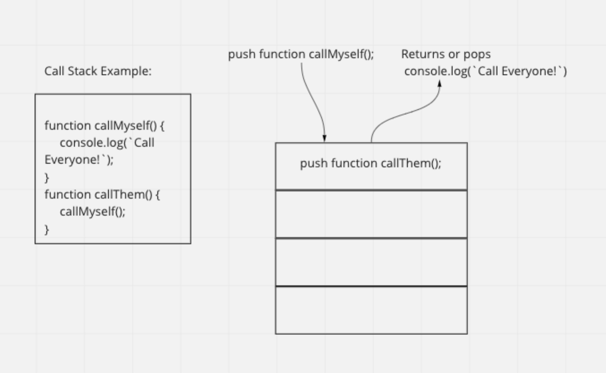

# In Memory Storage

## JavaScript Call Stacking

1. What is a ‘call’? A call is the action of invoking a function.

2. How many ‘calls’ can happen at once? There can only be one call at a time.

3. What does LIFO mean? Last in first out principle. When the last function gets pushed into the stack, and is the first to pop out when it returns the function. It’s a temporary storage order of events.

4. Draw an example of a call stack and the functions that would need to be invoked to generate that call stack.

5. What causes a Stack Overflow? When a function calls itself while invoking itself.

> Example:
function callMyself() {
    callMyself();
}
    callMyself();

## JavaScript error messages

1. What is a ‘reference error’?  A reference error is when you try to use a variable that isn’t defined. The temporal dead zone is when the errors are occurring in let or const due to hoisting time.

2. What is a ‘syntax error’?  Syntax errors are when you use improper subtract for the language. When you declare the language but use the syntax of another, the system is unable to understand and will throw errors until corrected.

3. What is a ‘range error’? A range error is when you manipulate an objects length yet the length is improperly used.

4. What is a ‘type error’? A type error is when you are trying to pose or access incompatible types. For example the rules for accessing a string are implemented yet the next line of code used, to access a number in error.

5. What is a breakpoint? A breakpoint is a line you type into your code which will intentionally break it for debugging purposes.  It is a line of code that will force your code block to stop running so you can debug what exactly went wrong with it.

6. What does the word ‘debugger’ do in your code? Adding the word Debugger to your code will run the history of your code block up until it.  This will give you the output or visual needed to see where your code exactly broke.

- > [Table Of Contents](READING-NOTES/README.md)

- > [Home Page](README.md)

### Resources

- > [The JavaScript Call Stack - What It Is and Why It's Necessary](https://www.freecodecamp.org/news/understanding-the-javascript-call-stack-861e41ae61d4)

- > [JavaScript error messages && debugging](https://codeburst.io/javascript-error-messages-debugging-d23f84f0ae7c?gi=5342683581e2)

